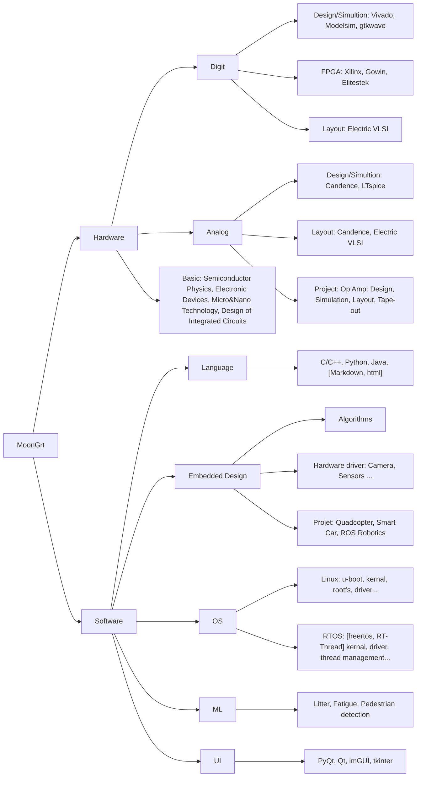

<!-- MoonGrt -->

```mermaid
graph LR
    MoonGrt --> Hardware;
        Hardware --> Digit
            Digit --> A1["Design/Simultion: Vivado, Modelsim, gtkwave"]
            Digit --> A2["FPGA: Xilinx, Gowin, Elitestek"]
            Digit --> A3["Layout: Electric VLSI"]
        Hardware --> Analog
            Analog --> A4["Design/Simultion: Candence, LTspice"]
            Analog --> A5["Layout: Candence, Electric VLSI"]
            Analog --> A6["Project: Op Amp: Design, Simulation, Layout, Tape-out"]
        Hardware --> Basic1["Basic: Semiconductor Physics, Electronic Devices, Micro&Nano Technology, Design of Integrated Circuits"]
    MoonGrt --> Software;
        Software --> Language --> B1["C/C++, Python, Java, [Markdown, html]"]
        Software --> B2["Embedded Design"] --> B3["Algorithms"]
                     B2["Embedded Design"] --> B4["Hardware driver: Camera, Sensors ..."]
                     B2["Embedded Design"] --> B5["Projet: Quadcopter, Smart Car, ROS Robotics"]
        Software --> OS --> B6["Linux: u-boot, kernal, rootfs, driver..."]
                     OS --> B7["RTOS: [freertos, RT-Thread] kernal, driver, thread management..."]
        Software --> ML --> B8["Litter, Fatigue, Pedestrian detection"]
        Software --> UI --> B9["PyQt, Qt, imGUI, tkinter"]
```
