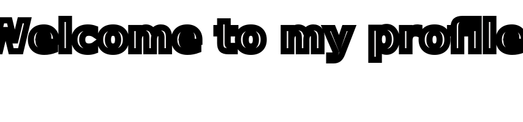

<div align="center">
  <!-- Welcome to my profile -->
  <a></a>

  <!-- dynamic typing effect 动态打字效果 -->
  <div>
    <a></a>
  </div>

  <!-- profile logo 个人资料徽标 -->
  <div>
    <!-- <a></a>&emsp; -->
    <a href="https://github.com/MoonGrt"></a>&emsp;
    <a></a>&emsp;
    <a></a>&emsp;
    <a href="https://wakatime.com/@2bc0290a-c657-457d-afa9-6eab19c66c4e"></a>&emsp;
    <!-- visitor -->
    <a>&emsp;  
  </div>

  <!-- Snake Code Contribution Map 贪吃蛇代码贡献图 -->
  <picture>
    <source media="(prefers-color-scheme: dark)" srcset="images/snake-dark.svg" />
    <source media="(prefers-color-scheme: light)" srcset="images/snake.svg" />
    
  </picture>

  

</div>


<!-- ########################################## 分割 ########################################## -->


## 📅 Activity Map

<div align="center">
  <!-- github-readme-streak-stats 连续提交代码天数记录 -->
  <picture>
    <source media="(prefers-color-scheme: dark)" srcset="https://github-readme-streak-stats.herokuapp.com/?user=MoonGrt&theme=dark&hide_border=true" />
    <source media="(prefers-color-scheme: light)" srcset="https://github-readme-streak-stats.herokuapp.com/?user=MoonGrt&theme=light&hide_border=true" />
    
  </picture>
  
  <!-- GitHub Activity Graph GitHub 活动图 -->
  <table>
    <tr>
      <td>
        <picture>
          <source media="(prefers-color-scheme: dark)" srcset="https://github-readme-activity-graph.vercel.app/graph?username=MoonGrt&theme=github-compact&bg_color=FF000000&hide_border=true&area=true" />
          <source media="(prefers-color-scheme: light)" srcset="https://github-readme-activity-graph.vercel.app/graph?username=MoonGrt&theme=github-compact&bg_color=FF000000&color=000000&hide_border=true&area=true" />
          
        </picture>
    </tr>
  </table>
</div>

<!--START_SECTION:waka-->


📅 **I'm Most Productive on Sunday** 

```text
Monday                   98 commits          ⣿⣿⣿⣀⣀⣀⣀⣀⣀⣀⣀⣀⣀⣀⣀⣀⣀⣀⣀⣀⣀⣀⣀⣀⣀   11.42 % 
Tuesday                  109 commits         ⣿⣿⣿⣀⣀⣀⣀⣀⣀⣀⣀⣀⣀⣀⣀⣀⣀⣀⣀⣀⣀⣀⣀⣀⣀   12.70 % 
Wednesday                130 commits         ⣿⣿⣿⣿⣀⣀⣀⣀⣀⣀⣀⣀⣀⣀⣀⣀⣀⣀⣀⣀⣀⣀⣀⣀⣀   15.15 % 
Thursday                 110 commits         ⣿⣿⣿⣀⣀⣀⣀⣀⣀⣀⣀⣀⣀⣀⣀⣀⣀⣀⣀⣀⣀⣀⣀⣀⣀   12.82 % 
Friday                   93 commits          ⣿⣿⣿⣀⣀⣀⣀⣀⣀⣀⣀⣀⣀⣀⣀⣀⣀⣀⣀⣀⣀⣀⣀⣀⣀   10.84 % 
Saturday                 96 commits          ⣿⣿⣿⣀⣀⣀⣀⣀⣀⣀⣀⣀⣀⣀⣀⣀⣀⣀⣀⣀⣀⣀⣀⣀⣀   11.19 % 
Sunday                   222 commits         ⣿⣿⣿⣿⣿⣿⣀⣀⣀⣀⣀⣀⣀⣀⣀⣀⣀⣀⣀⣀⣀⣀⣀⣀⣀   25.87 % 
```


📊 **This Week I Spent My Time On** 

```text
🕑︎ Time Zone: Asia/Shanghai

🔥 Editors: 
VS Code                  127 hrs 20 mins     ⣿⣿⣿⣿⣿⣿⣿⣿⣿⣿⣿⣿⣿⣿⣿⣿⣿⣿⣿⣿⣿⣿⣿⣿⣿   99.75 % 
Chrome                   13 mins             ⣀⣀⣀⣀⣀⣀⣀⣀⣀⣀⣀⣀⣀⣀⣀⣀⣀⣀⣀⣀⣀⣀⣀⣀⣀   00.18 % 
Edge                     5 mins              ⣀⣀⣀⣀⣀⣀⣀⣀⣀⣀⣀⣀⣀⣀⣀⣀⣀⣀⣀⣀⣀⣀⣀⣀⣀   00.07 % 

🐱‍💻 Projects: 
MoonGrt                  127 hrs 39 mins     ⣿⣿⣿⣿⣿⣿⣿⣿⣿⣿⣿⣿⣿⣿⣿⣿⣿⣿⣿⣿⣿⣿⣿⣿⣿   100.00 % 

💻 Operating System: 
Windows                  127 hrs 39 mins     ⣿⣿⣿⣿⣿⣿⣿⣿⣿⣿⣿⣿⣿⣿⣿⣿⣿⣿⣿⣿⣿⣿⣿⣿⣿   100.00 % 
```

**I Mostly Code in Verilog** 

```text
Verilog                  5 repos             ⣿⣿⣿⣿⣿⣀⣀⣀⣀⣀⣀⣀⣀⣀⣀⣀⣀⣀⣀⣀⣀⣀⣀⣀⣀   21.74 % 
Python                   5 repos             ⣿⣿⣿⣿⣿⣀⣀⣀⣀⣀⣀⣀⣀⣀⣀⣀⣀⣀⣀⣀⣀⣀⣀⣀⣀   21.74 % 
C                        5 repos             ⣿⣿⣿⣿⣿⣀⣀⣀⣀⣀⣀⣀⣀⣀⣀⣀⣀⣀⣀⣀⣀⣀⣀⣀⣀   21.74 % 
HTML                     2 repos             ⣿⣿⣀⣀⣀⣀⣀⣀⣀⣀⣀⣀⣀⣀⣀⣀⣀⣀⣀⣀⣀⣀⣀⣀⣀   08.70 % 
C++                      2 repos             ⣿⣿⣀⣀⣀⣀⣀⣀⣀⣀⣀⣀⣀⣀⣀⣀⣀⣀⣀⣀⣀⣀⣀⣀⣀   08.70 % 
```


<!--END_SECTION:waka-->

<!-- ########################################## 分割 ########################################## -->


## 🏆 Github Profile Trophy

<div align="center" >
  <!-- GitHub 奖杯 -->
  <div><br/></div>

  <!-- GitHub 数据统计 -->
  
  <br>
</div>


<!-- ########################################## 分割 ########################################## -->
 

## 📚 Skills

<div class="center">
  
   | Category                                | 	Skills / Tools |
   |-----------------------------------------|----------------------------------------------------------------------------------------------------------------------------------------------------------------------------------------------------------------------------------------------------------------------------------------------------------------------------------------------------------------------------------------------------------------------------------------------------------------------------------------------------------------------------------------------------------------------------------------------------------------------------------------------------------------------------------------------------------------------------------------------------------------------------------------------------------------------------------------------------------------------------------------------------------------------------------------------------------------------------------------------------------------------------------------------------------------------------------------------------------------------------------------------------------------------------------------------------------------------------------------------------------------------------------------------------------------------------------------------------------------------------------------------------------------------------------------------------------------------|
   | **Programming Languages**               |          |
   | **Integrated Development Environments** |         |
   | **Hardware Platform**                   |         |
   | **Operation System**                    |          |
   | **Simulation / Design Tools**           |          |

  <!-- MoonGrt MindMap -->
  <div align="center">
  
  </div>
</div>


<!-- ########################################## 分割 ########################################## -->
<div align="center">
  
  
</div>
